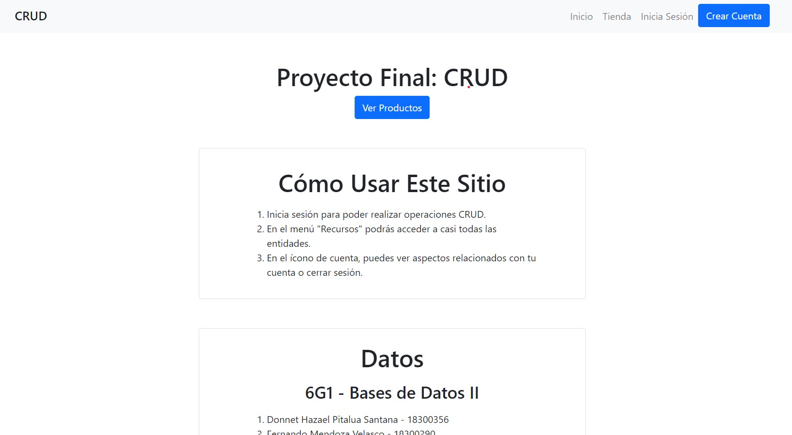

# Database Design Final Project: CRUD System

> Text on the website is in Spanish

This website was the final project for one of my school courses, "Databases I & II". I worked along one other classmate to develop this CRUD system using PHP, MySQL and Bootstrap. While it is not as well implemented as I would like, this project was still  an "excuse" to learn PHP and use the skills and knowledge we learned from the course. 

In total, we were given three weeks to develop the project, including the E-R and table diagrams, the data dictionary, two concise documentation files and the project itself.

Check out the deployed project at [Heroku](https://crud-8.herokuapp.com/)

## Features
- Browse a simple web-based store.
- Log-in to accounts with different permission levels.
- Create, Read, Update and Delete entities such as products, orders or users.

## Requirements
- PHP (^8.0.0)
- Composer (2.0.14 used)
- MySQL (5.7.24 used)